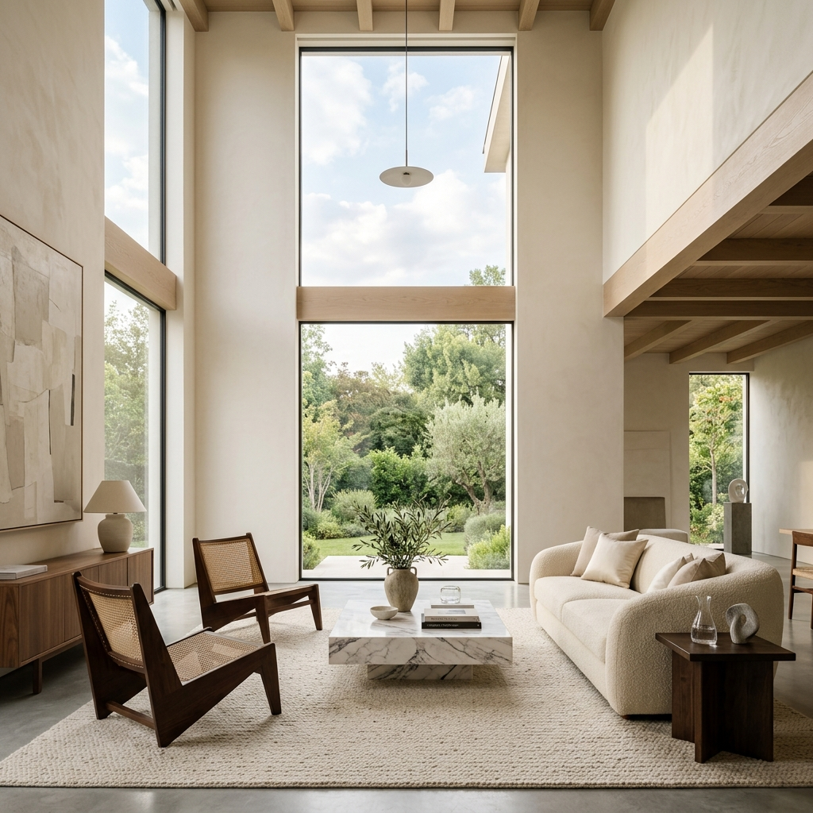

# LUMINO | Premium Minimalist E-commerce Template

LUMINO is a sophisticated, single-page e-commerce frontend template built with **Vanilla HTML, CSS, and JavaScript**. Designed for high-end home decor and minimalist brands, it offers a seamless, app-like experience without the overhead of heavy frameworks.



## ✨ Features

- **Single-File Architecture**: The entire application (routing, styling, and logic) is contained within a single `index.html` file.
- **Lightweight Hash Router**: Smooth navigation between Home, Shop, Product Detail, Cart, About, and Contact pages using `#/` routing.
- **Cart System**: Fully functional cart with `localStorage` persistence, real-time badge updates, and quantity management.
- **Premium Design System**:
  - **Typography**: Elegant pairing of *Fraunces* (display) and *DM Sans* (body).
  - **Aesthetics**: Minimalist "Soft Studio" aesthetic with glassmorphism, smooth transitions, and Ken Burns animations.
  - **Responsive**: Mobile-first design with a custom-built hamburger menu.
- **Zero Dependencies**: No frameworks, no external libraries (except Google Fonts), and no build steps required.

## 🎨 Design System

| Element | Specification |
| :--- | :--- |
| **Primary Color** | `#1a1a1a` (Rich Black) |
| **Accent Color** | `#b8860b` (Gold) / `#1a7a4a` (Success Green) |
| **Background** | `#ffffff` / `#f7f7f5` (Subtle Grey) |
| **Border Radius** | 6px (sm), 10px (md), 16px (lg) |
| **Spacing** | 8px Base Grid |

## 🚀 Getting Started

Since this is a static project, there is no installation required.

1. Clone the repository:
   ```bash
   git clone https://github.com/GaziMahmudur/E-commerce-Frontend-Template.git
   ```
2. Open `index.html` in your preferred browser.

## 🛠️ Built With

- **HTML5**: Semantic structure.
- **CSS3**: Modern layout (Grid, Flexbox) and variables.
- **Vanilla JavaScript**: DOM manipulation, Hash Routing, and State Management.

## 📄 License

This project is open-source and available under the [MIT License](LICENSE).

---
*Created with focus on performance, aesthetics, and simplicity.*
